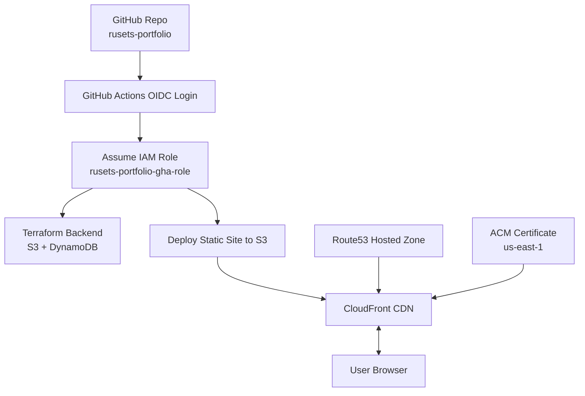

# Portfolio Website Infrastructure
### Secure static hosting on AWS with Terraform and GitHub Actions OIDC

<p align="center">
  
  
  
  
  
  
  
</p>

I designed and built this project as the infrastructure behind my personal portfolio website, applying the same security and automation standards I use in real AWS environments.

The stack is fully automated and secure by design: Terraform for Infrastructure as Code, private S3 with CloudFront (OAC), ACM-managed TLS, and GitHub Actions with OIDC for completely keyless CI/CD.

My goal was straightforward — eliminate long-lived credentials, minimize operational overhead, and create infrastructure that is easy to understand, audit, and extend simply by reading the code.

---

# Overview

I use this setup to host **[rusets.com](https://rusets.com)** as a fully automated static website stack, using Terraform and GitHub Actions OIDC for deployment.
The main goal was to keep the infrastructure secure and straightforward without adding unnecessary complexity.

Core principles:
- **Private-by-default** design (S3 locked, CloudFront OAC)
- **No AWS keys** — GitHub Actions authenticates via OIDC
- **Separation of stages** (bootstrap backend → deploy infra)
- **Fully automated deployments** on every push to `main`
- **Zero maintenance** and minimal AWS cost

The result is a modern, secure, globally distributed portfolio website powered entirely by Infrastructure-as-Code.
---

#  Architecture Diagram (Mermaid)



---

# Tech Stack Summary

| Layer       | Technology / Services |
|-------------|------------------------|
| **Cloud**   | AWS (S3, CloudFront, Route53, ACM) |
| **IaC**     | Terraform (modular, multi-folder layout) |
| **CI/CD**   | GitHub Actions with OIDC (no long-lived AWS keys) |
| **Security**| CloudFront OAC, private S3, HTTPS/TLS, IAM least-privilege |
| **Frontend**| HTML, CSS, JS (neon/glassmorphism UI) |
| **Validation** | checkov • tfsec • tflint |
| **Domain**  | rusets.com |

---

## **Project Structure**


```text
rusets-portfolio/
├── .github/              # GitHub Actions workflows
│   └── workflows/
├── docs/                 # Architecture document + screenshots
│   └── screenshots/
├── infra/                # Main Terraform (S3, CloudFront, Route53, IAM)
├── infra-bootstrap/      # Terraform backend bootstrap (S3 + DynamoDB)
├── site/                 # Static site (HTML/CSS/JS)
├── .gitignore            # Ignore rules
├── .tflint.hcl           # TFLint configuration
├── LICENSE               # MIT license
└── README.md             # Main documentation
```

**Full detailed structure:** see [`docs/architecture.md`](./docs/architecture.md)

---

## Requirements

Before deploying, make sure you have:

- AWS account with basic IAM permissions
- Domain purchased (e.g., **rusets.com**)
- Namecheap → Route53 NS delegation (required for DNS validation)
- Terraform ≥ 1.6 installed locally
- GitHub repository connected to this project
- GitHub Actions OIDC enabled (Terraform configures the IAM role automatically)

---

#  Deployment Flow

## **1. Bootstrap Terraform backend**

```bash
cd infra-bootstrap
terraform init
terraform apply
```

## **2. Deploy full infrastructure**

```bash
terraform apply
```

## **3. Upload static site (automatic)**  
Push to main branch:

```bash
git add .
git commit -m "update site"
git push
```

GitHub Actions will:

1. Assume OIDC role  
2. Sync `site/` → S3  
3. Invalidate CloudFront  
4. Website updates instantly  

---

#  IAM & Security Model

- No long-lived AWS access keys — GitHub Actions authenticates via **OIDC**  
- S3 website bucket is **private** (no public ACLs / no public bucket policy)  
- CloudFront reads objects through **Origin Access Control (OAC)**  
- All traffic is served over **HTTPS** with an ACM certificate in `us-east-1`  
- DNS records (Route53) and IAM roles/policies are managed by Terraform  
- CI/CD role is scoped to deploy static files, manage CloudFront invalidations, and access Terraform backend state

For a full breakdown of security decisions and trade-offs, see  
[`docs/architecture.md`](./docs/architecture.md).

---

## Why Some Security/Best-Practice Checks Are Intentionally Skipped

This is a **static personal portfolio**, not a regulated production system.  
Some AWS/Terraform “best practices” provide little practical value here but increase cost and operational overhead.

To keep the stack **secure, lightweight, and inexpensive**, a few checks are intentionally skipped:

### ✔ S3 Versioning & Logging
Unnecessary for static content tracked in Git; logging/versioning increases S3 cost.

### ✔ DynamoDB PITR & KMS
The lock table stores no real data — only temporary Terraform locks.

### ✔ S3 KMS-CMK Encryption
AES256 (SSE-S3) is sufficient; CMKs add cost and IAM complexity without real benefit.

### ✔ Lifecycle Rules & Event Notifications
Useful in large systems, not relevant for a small static site.

### ✔ CloudFront Access Logs
Adds constant S3 charges; not needed for low-traffic portfolio traffic.

**All decisions are documented, reversible, and safe for this project’s scope.**

---

# Troubleshooting

### **403: AccessDenied from S3**
**Cause:** CloudFront OAC not yet attached or distribution not updated.  
**Fix:** Re-apply the infrastructure after ACM validation completes.

---

### **ACM certificate stuck in “Pending validation”**
- Make sure the DNS CNAME record exists in Route53  
- Verify Namecheap → Route53 NS delegation  
- Wait 10–20 minutes (ACM in us-east-1 is sometimes slow)

---

### **GitHub Actions cannot assume IAM role**
- Ensure your repo matches the trust policy:  
  `repo:rusets/rusets-portfolio:*`
- Re-run the workflow after pushing changes  
- Check that OIDC provider is available in IAM

---

### **CloudFront cache not updating**
Fix:

```bash
aws cloudfront create-invalidation \
  --distribution-id XXXXXXXXX \
  --paths "/*"
```

---

# Lessons Learned

- **Route53 NS delegation must happen before ACM validation**  
  Otherwise the certificate stays in “Pending validation”.

- **CloudFront OAC is the modern, secure replacement for OAI**  
  Clean integration with private S3 buckets.

- **Terraform backend must exist before the main apply**  
  The two-stage (`infra-bootstrap` → `infra`) flow prevents state issues.

- **GitHub Actions OIDC removes all risks tied to static AWS keys**  
  No secrets stored anywhere, secure by design.

- **Correct S3 bucket policies are critical**  
  Private bucket + OAC → CloudFront only → safe and predictable.

- **CloudFront requires the ACM certificate in us-east-1**  
  Common mistake for many engineers; mandatory for global distributions.

- **S3 sync + CloudFront invalidation provides instant deployments**  
  Fast global propagation with zero manual interaction.

---

# Future Work

- **CloudFront access logs (optional)**  
  Enable logging only if analytics or debugging is required.

- **Lighthouse / Pagespeed CI checks**  
  Add automated performance scoring for each deployment.

- **Per-branch preview deployments**  
  Temporary CloudFront distributions for PR previews.

- **AWS WAF rate-limiting rules**  
  Basic protection against bots and accidental traffic spikes.

- **Monitoring integration**  
  Optional dashboards using CloudWatch Metrics or Grafana.

- **Static asset optimization**  
  Minification + compression pipelines in GitHub Actions. 

---

### Summary  
We intentionally optimized for:

- **Security where it matters** (private S3, OAC, HTTPS, OIDC CI/CD)  
- **Simplicity** (no unnecessary AWS components)  
- **Zero maintenance overhead**  
- **Minimal cost** — ideal for personal infrastructure  

All skipped checks are safe for this context and clearly documented.  
If requirements grow later, each option can be enabled with a single Terraform change.

---

# Screenshots

## Home / Hero Section


**Shows:** the main landing section with neon RGB visuals, animated starfield, “Ruslan AWS” branding, and call-to-action buttons.

---

## Projects Grid


**Shows:** the full 8-project grid with clean card layout, hover effects, and structured presentation of AWS/DevOps projects.

---

## GitHub Actions Workflows


**Shows:** automated CI/CD pipelines using GitHub OIDC — including site deployment workflow and Terraform plan/apply automation.

---

## CloudFront Distribution


**Shows:** CloudFront configuration with S3 origin, OAC, custom domain `rusets.com`, HTTPS certificate validation, and CDN settings.

---
## License

This project is released under the MIT License.

See the `LICENSE` file for details.