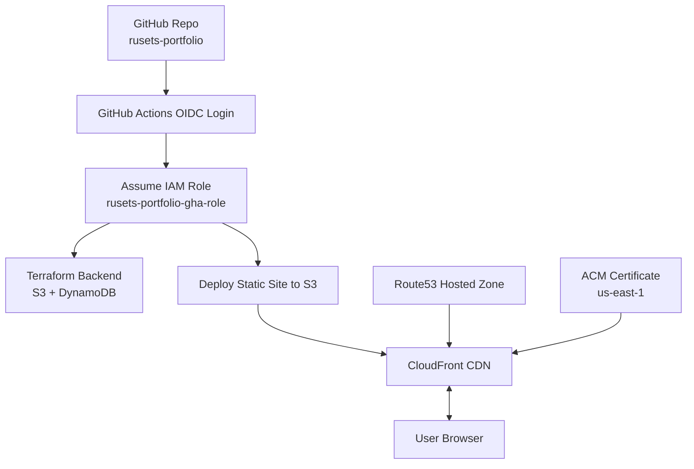
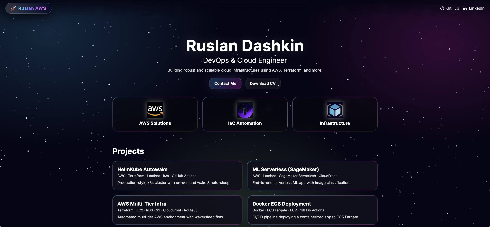
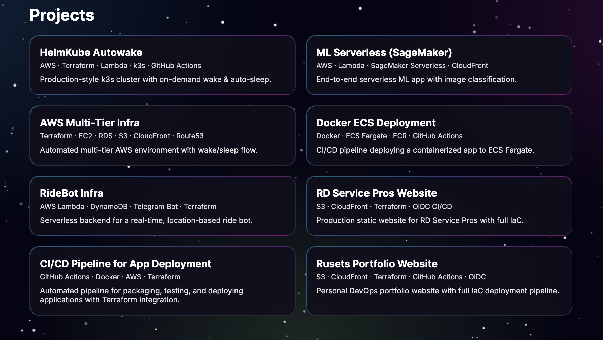
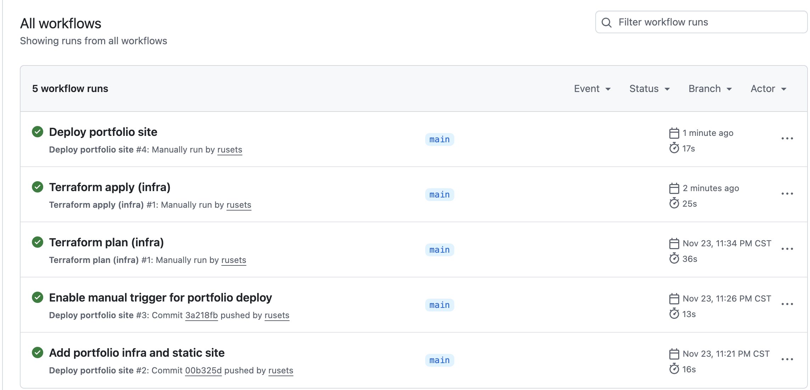
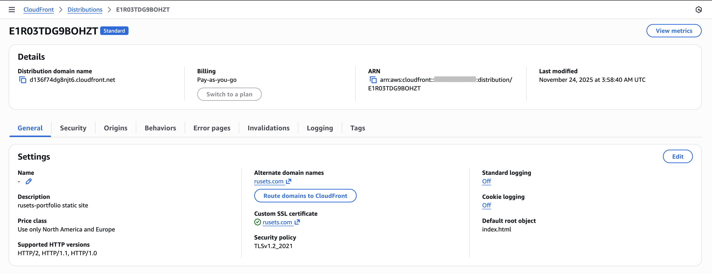

#  Ruslan AWS — Portfolio Infrastructure  
### **Static Website on AWS (S3 + CloudFront + Route53 + Terraform + GitHub Actions OIDC)**  

<p align="left">
  
  
  
  
  
</p>

A fully automated, production-ready infrastructure for my personal DevOps portfolio website.  
Features secure static hosting on **S3**, global delivery via **CloudFront**, **HTTPS with ACM**, and **zero-secret CI/CD** using **GitHub Actions OIDC**.

---

#  Overview

This project demonstrates how to deploy a secure, scalable, real-world static website infrastructure on AWS using Terraform + GitHub Actions OIDC.

Infrastructure includes:

- Private S3 bucket for site files  
- CloudFront CDN with modern TLS  
- Route53 zone & records  
- ACM certificate (DNS validated)  
- OIDC role for GitHub Actions (no long-lived AWS keys)  
- Push-to-deploy pipeline  
- Auto-invalidation of CloudFront cache  

Everything is 100% Infrastructure-as-Code.

---

#  Architecture Diagram (Mermaid)



---

#  Tech Stack Summary

| Layer | Technology |
|------|------------|
| Cloud | AWS (S3, CloudFront, Route53, ACM) |
| IaC | Terraform (multi-file, production formatting) |
| CI/CD | GitHub Actions + OIDC (no secrets) |
| Frontend | HTML, CSS, JS (custom neon RGB design) |
| Security | OAC → S3 Private Bucket, HTTPS, DNS validation |
| Domains | rusets.com |

---

#  Repository Structure

```text
rusets-portfolio/
├── .github/
│   └── workflows/
│       ├── portfolio.yml
│       ├── infra-plan.yml
│       └── infra-apply.yml
├── .gitignore
├── docs/
│   └── screenshots/
├── infra/
│   ├── backend.tf
│   ├── dns.tf
│   ├── github_oidc.tf
│   ├── locals.tf
│   ├── outputs.tf
│   ├── providers.tf
│   ├── site_s3_cloudfront.tf
│   └── variables.tf
├── infra-bootstrap/
│   ├── locals.tf
│   ├── outputs.tf
│   ├── providers.tf
│   ├── state_storage.tf
│   ├── terraform.tfstate
│   └── variables.tf
├── site/
│   ├── index.html
│   ├── error.html
│   ├── styles.css
│   ├── script.js
│   └── assets/
└── README.md
```

---

#  Requirements

Before deploying:

- AWS account  
- Route53 hosted zone (created by Terraform — requires Namecheap NS delegation)
- Terraform ≥ 1.6  
- GitHub repo  
- Domain purchased (e.g., **rusets.com**)    
- GitHub Actions OIDC enabled (Terraform handles this)

---

#  Deployment Flow

## **1. Bootstrap Terraform backend**

```bash
cd infra-bootstrap
terraform init
terraform apply
```

## **2. Deploy full infrastructure**

```bash
terraform apply
```

## **3. Upload static site (automatic)**  
Push to main branch:

```bash
git add .
git commit -m "update site"
git push
```

GitHub Actions will:

1. Assume OIDC role  
2. Sync `site/` → S3  
3. Invalidate CloudFront  
4. Website updates instantly  

---

#  IAM & Security Model

- No static AWS keys  
- GitHub → OIDC → IAM role  
- S3 bucket **private**  
- CloudFront uses **OAC**  
- ACM TLS is **DNS validated**  
- Route53 records managed via Terraform  
- CI/CD is least-privilege (after cleanup phase)

---

#  Troubleshooting

### **403 AccessDenied from S3**
Cause: CloudFront OAC not attached.  
Fix: Re-apply infra after certificate validation.

---

### **ACM certificate stuck “Pending validation”**
Fix:  
- Confirm DNS CNAME created  
- Ensure Namecheap → AWS Route53 NS delegation is correct  
- Wait 10–20 minutes

---

### **GitHub Actions cannot assume IAM role**
Fix:
- Check repo name matches OIDC condition  
- Ensure `sub: repo:rusets/rusets-portfolio:*`  
- Re-run workflow  

---

### **CloudFront cache not updating**
Fix:

```bash
aws cloudfront create-invalidation \
  --distribution-id XXXXXXXXX \
  --paths "/*"
```

---

#  Lessons Learned

- Route53 NS delegation must happen **before** ACM validation  
- CloudFront OAC is superior to legacy OAI  
- Terraform S3 backend must exist *before* full `apply`  
- GitHub Actions OIDC eliminates ALL access keys  
- Using `aws_s3_bucket_policy` correctly prevents public exposure  
- CloudFront requires certificate in **us-east-1 only**  
- S3 sync + CloudFront invalidation = super fast deployment  

---

#  Future Work
 
- Add GitHub Actions test stage (HTML validator, minifier)  
- Add automatic Lighthouse performance report  
- Add WAF + rate limiting  
- Add per-branch preview deployments  
- Add CloudFront logging to S3  
- Add monitoring dashboard (CloudWatch / Grafana)  

---

# Screenshots

## Home / Hero Section


**Shows:** the main landing section with neon RGB visuals, animated starfield, “Ruslan AWS” branding, and call-to-action buttons.

---

## Projects Grid


**Shows:** the full 8-project grid with clean card layout, hover effects, and structured presentation of AWS/DevOps projects.

---

## GitHub Actions Workflows


**Shows:** automated CI/CD pipelines using GitHub OIDC — including site deployment workflow and Terraform plan/apply automation.

---

## CloudFront Distribution


**Shows:** CloudFront configuration with S3 origin, OAC, custom domain `rusets.com`, HTTPS certificate validation, and CDN settings.

---

#  License

- Released under the **MIT License** — free to use, modify, and learn from.  
- © **Ruslan Dashkin (“🚀 Ruslan AWS”)**.  
- The branding “🚀 Ruslan AWS” and related visuals are protected against commercial reuse.